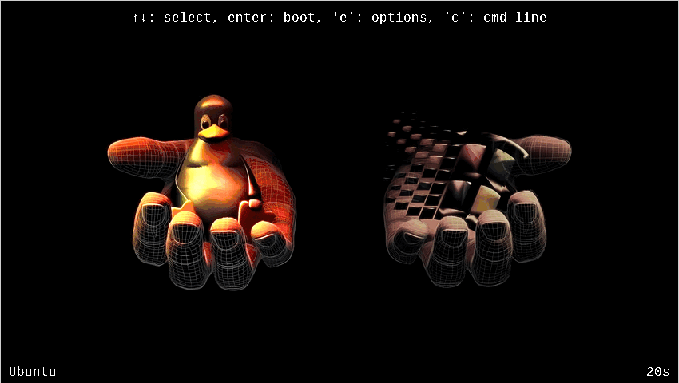

# dotfiles

Ubuntu + i3 desktop rice. All theming is driven automatically from the wallpaper via [pywal](https://github.com/dylanaraps/pywal) — every 350 seconds a new wallpaper is picked at random and the entire color scheme regenerates across the terminal, status bar, app launcher, and Discord.




---

## Stack

| Role | Tool |
|---|---|
| Window manager | i3 |
| Status bar | Polybar |
| Terminal | Alacritty |
| Compositor | Picom |
| App launcher | Rofi |
| Color engine | pywal (pywal16) |
| Wallpaper setter | feh |
| Lock screen | matrixlock (cmatrix + i3lock) |
| Discord client | Vesktop (Flatpak) |

---

## How the theme chain works
;
```
systemd wallpaper.timer (every 350s)
  └─▶ wallpaper.service
        └─▶ wallpaper.sh
              ├─ feh --bg-fill          sets random wallpaper
              ├─ wal -i                 generates 16-color palette + processes all templates:
              │    ├─ colors-polybar.ini    → polybar color roles
              │    ├─ colors-rofi.rasi      → rofi accent colors
              │    └─ colors-discord.css    → Vesktop Quick CSS variables
              │    └─ escape sequences      → updates all open terminals live
              ├─ cp colors-polybar.ini  → ~/.config/polybar/colors-polybar.ini
              ├─ cp colors-discord.css  → Vesktop quickCss.css, then restarts Vesktop
              └─ launch_bar.sh polybar  → kills + restarts polybar with new palette
```

Alacritty imports `~/.cache/wal/colors-alacritty.toml` at launch — every new terminal gets the current palette automatically. Open terminals update live via wal's escape sequences.

---

## Install

### Prerequisites

```bash
# apt packages (i3, alacritty, polybar, picom, rofi, feh, pamixer, cmatrix, etc.)
bash scripts/apt-installs.sh

# pipx packages (pywal, yt-dlp, bpytop)
bash scripts/pipx-installs.sh
pipx ensurepath

# flatpak apps (Vesktop, Bottles, Heroic, Obsidian)
bash scripts/flatpak-installs.sh
```

### Deploy configs

```bash
cd scripts
bash update-dots.sh
```

### Enable wallpaper timer

```bash
systemctl --user daemon-reload
systemctl --user enable --now wallpaper.timer
```

Log out and back into i3 — the timer fires 5 seconds after login, sets a wallpaper, and generates the first palette.

---

## Repo layout

```
dots/           versioned config snapshots (dots/*/current/ → ~/.config/*)
scripts/        install + deploy scripts
wallpapers/     wallpaper images
grub-matrix-pill/   standalone GRUB theme for Windows/Linux dual-boot
```

Each component under `dots/` keeps numbered `backupN/` snapshots alongside `current/`. The live `~/.config/` files are the source of truth — `dots/current/` is the versioned copy. After editing a live config, snapshot it into `dots/*/current/` and commit.

To check which live files have drifted from the repo:

```bash
cd scripts && bash diff-dots.sh
```

---

## Customization

**Shift accent colors** — edit `~/.config/wal/templates/colors-polybar.ini` and swap which `{color0}`–`{color15}` maps to `primary`, `secondary`, etc. Same idea for `colors-rofi.rasi` (`{color2}` is the accent) and `colors-discord.css`. Regenerate with `wal -R`.

**Change wallpaper rotation interval** — edit `OnUnitActiveSec` in `dots/systemd/current/wallpaper.timer`, then `systemctl --user daemon-reload && systemctl --user restart wallpaper.timer`.

**Add a polybar module** — drop a script in `dots/polybar/current/scripts/` that prints one line, add a `[module/name]` block to `config.ini`, and add the name to `modules-right`.

---

## GRUB theme

`grub-matrix-pill/` is a standalone matrix-pill GRUB theme for Windows/Linux dual-boot systems.

```bash
sudo ./grub-matrix-pill/universal-installer.sh
# non-interactive (e.g. from autoinstall):
sudo bash scripts/install-grub-theme.sh 1920x1080 1
```
